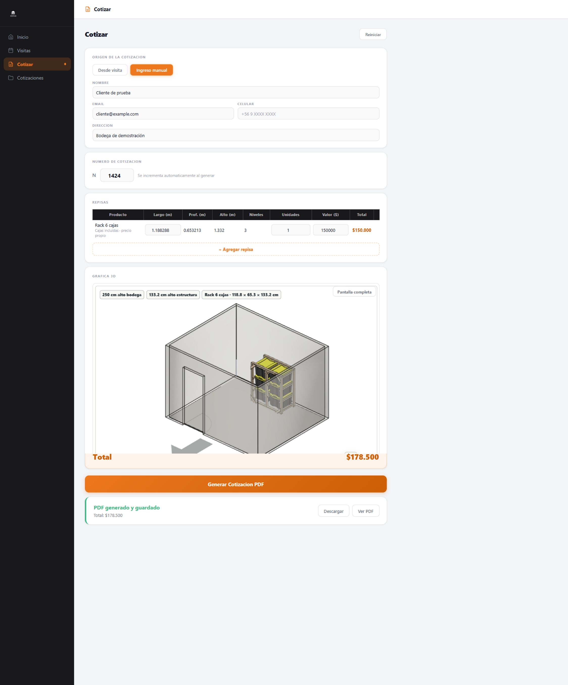
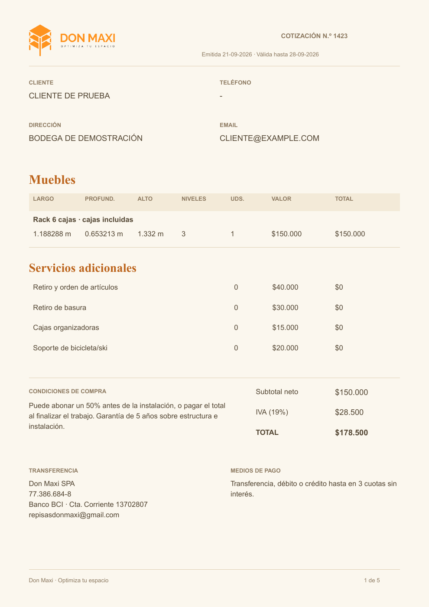
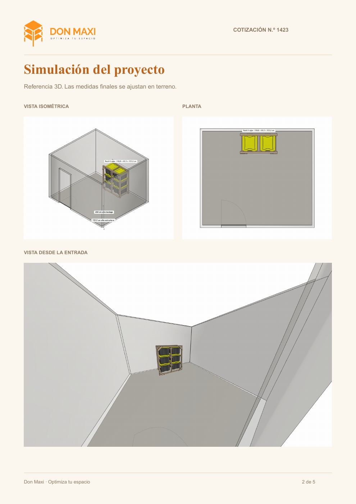

# Validación de racks en el ERP

Prueba realizada en el navegador integrado contra los servicios nativos y backend simulado el 21-09-2026.

- Rack recibido como producto propio; dimensiones fijas y cajas incluidas.
- Precio vacío bloqueó la generación; se ingresaron $150.000 netos **solo como dato de prueba**, no como tarifa comercial.
- Movimiento y recarga conservaron el modelo y precio.
- PDF descargado: cinco páginas, subtotal $150.000, IVA $28.500, total $178.500; sin cajas adicionales cobradas.
- Primera página y tres vistas de la segunda página inspeccionadas visualmente.
- `npm test`: 16 pruebas aprobadas, incluidas persistencia del precio por modelo y validación del PDF. `npm run build`: aprobado.

[PDF de prueba](cotizacion-rack-completo.pdf)
